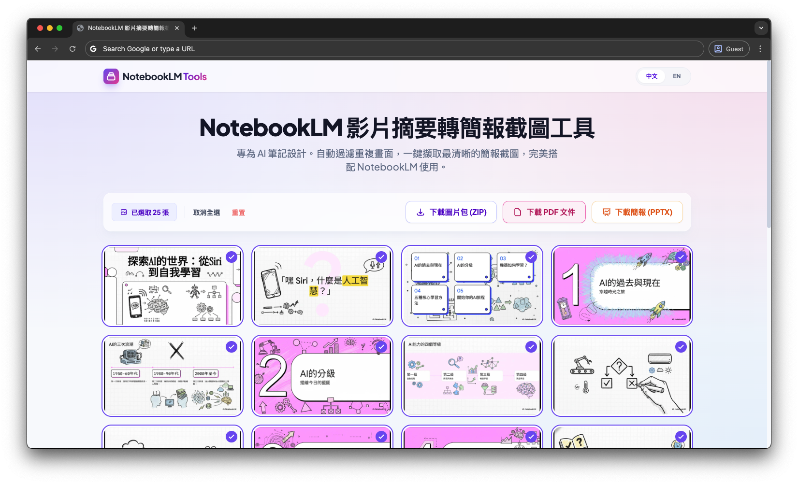

# NotebookLM 影片摘要輔助工具：簡報畫面擷取器
您是否在使用 [NotebookLM](https://notebooklm.google.com/) 處理影片筆記時，希望能方便地將影片中的簡報畫面擷取出來，與您的文字筆記對應？這個工具正是為此而生。

當您將 YouTube 影片匯入 NotebookLM 進行摘要後，本工具可以針對同一部影片，自動化地分析內容、過濾掉重複的畫面，並將所有不重複的關鍵簡報擷取出來，讓您可以一鍵匯出成多種格式。

## ✨ 主要功能

- **智能畫面過濾**: 自動比較影片中的每一幀，過濾掉重複或相似度極高的畫面，只保留最關鍵的投影片。
- **純前端處理**: 所有影片分析與畫面擷取都在您的瀏覽器中完成，影片檔案不會上傳到任何伺服器，確保您的資料隱私與安全。
- **多種匯出格式**:
  - **圖片包 (ZIP)**: 將所有擷取的簡報畫面打包成一個 ZIP 檔案。
  - **PDF 文件**: 將所有畫面合併成一個 PDF 檔案，方便閱讀與分享。
  - **PowerPoint (PPTX)**: 直接生成一個 .pptx 簡報檔案，每張投影片包含一個擷取的畫面。
- **多語言支援**: 內建中文與英文介面。

## 🚀 工作流程

1.  在 NotebookLM 中，加入您的資料來源並取得摘要影片。
2.  在本工具頁面（`index.html`），上傳或拖放**同一部**原始影片檔案。
3.  工具會自動處理影片，並在下方顯示所有擷取到的不重複簡報畫面。您可以手動取消勾選不需要的畫面。
4.  選擇您想要的格式（ZIP, PDF, 或 PPTX），然後點擊下載，即可將簡報畫面與您的 NotebookLM 筆記搭配使用。

## 🖼️ 介面預覽

